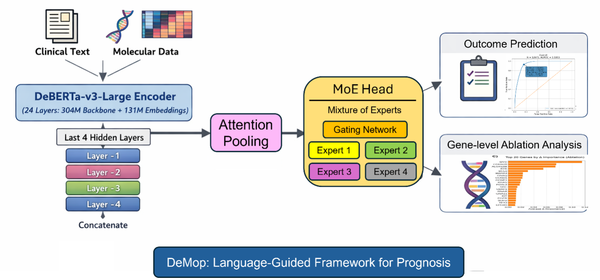

# DeMoP

DeMoP is a fine-tuned DeBERTa-v3-large + mixture-of-experts (MoE) framework for disease prognosis from structured natural-language descriptions of integrated clinical and molecular data.

This repository contains three main scripts:

- `demop_model_training.py`: train the DeMoP model and save the tokenizer and model weights.
- `demop_inference.py`: load a trained model and run batch inference on a CSV file.
- `demop_gene_ablation.py`: run gene-segment ablation analysis to estimate the contribution of mutation-profile segments to model predictions.

## Manuscript information

**DeMoP: A Language-Model-Guided Mixture-of-Experts Framework for Disease Cancer Prognosis**

Chen Tang<sup>†</sup>, Lei Yu<sup>†</sup>, Qiwei Li, and Lin Xu<sup>*</sup>

<sup>†</sup> These authors contributed equally to this work.  
<sup>*</sup> Corresponding author.

Manuscript in preparation, 2026. Title and author information are current as of August 23, 2026.

[**Manuscript PDF**](./DeMoP_20260823_NEW.pdf) as of August 23, 2026.



**Figure 1.** Schematic overview of the DeMoP framework. Patient-level clinical and molecular features are serialized into structured natural-language representations and encoded by DeBERTa-v3-large. Concatenated representations from the final four hidden layers are then processed by an attention-based pooling module and a ResNet-based mixture-of-experts prediction head for pan-cancer outcome prediction and gene-importance analysis. The number of experts shown here is illustrative only and can be adjusted.

## Environment setup

### 1. Create and activate a conda environment

Note: Python 3.10 is recommended. Python 3.11 and 3.12 may also work, but have not been verified.

```bash
conda create -n demop python=3.10 -y
conda activate demop
```

### 2. Upgrade pip

```bash
python -m pip install --upgrade pip
```

### 3. Install required packages with pip

For a standard setup:

```bash
pip install torch pandas numpy scikit-learn transformers accelerate sentencepiece matplotlib jupyter ipykernel
```

If you are using a specific CUDA version, install the appropriate PyTorch build for your system first, then install the remaining packages:

```bash
pip install pandas numpy scikit-learn transformers accelerate sentencepiece matplotlib jupyter ipykernel
```

## Main dependencies

- Python 3.10
- PyTorch
- Transformers
- pandas
- numpy
- scikit-learn
- sentencepiece
- accelerate
- matplotlib
- jupyter

## Input data format

The scripts expect CSV files with at least the following columns:

- `description`: structured natural-language representation of each patient
- `os_group`: binary label for prognosis / survival classification
- `CANCER_TYPE`
- `CANCER_TYPE_DETAILED`

For gene ablation analysis, the `description` field should contain a section formatted like:

```text
GENE MUTATION PROFILE: TP53 mutation; EGFR amplification; ...
```

The ablation script extracts semicolon-separated gene segments from this section and removes them one at a time.

## Model training

Train the model with:

```bash
bash run_demop_model_training.sh
```

This script:

- loads the dataset and train/test split files
- trains the DeMoP model
- evaluates on validation and test data
- saves predictions for train and test sets
- saves the trained tokenizer and model weights to:

```text
deberta_finetuned_custom_OS_0422_EarlyStopping/
```

Saved files typically include:

- `model_weights.pth`
- tokenizer files saved by `save_pretrained(...)`

## Inference

Run batch inference with:

```bash
bash run_demop_inference.sh
```

This script:

- rebuilds the same DeMoP architecture used in training
- loads the trained weights from `deberta_finetuned_custom_OS_0422_EarlyStopping/model_weights.pth`
- loads the tokenizer from `deberta_finetuned_custom_OS_0422_EarlyStopping/`
- predicts class labels and probabilities for each sample
- optionally computes metrics if labels are available

## Gene ablation analysis

Run gene-segment ablation with:

```bash
bash run_demop_gene_ablation.sh
```

This script:

- loads the same trained DeMoP model used for inference
- parses gene mutation segments from `GENE MUTATION PROFILE:` in each sample
- removes one segment at a time
- re-runs the model after each removal
- measures the change in the original predicted class probability
- aggregates average delta scores across all samples

A larger delta indicates that removing that gene segment leads to a larger drop in the model's confidence for its original prediction.

## Notes

1. Keep the folder `deberta_finetuned_custom_OS_0422_EarlyStopping/` in the repository root unless you also update the paths in the scripts.
2. The inference and ablation scripts assume that the saved model weights and tokenizer are already available.
3. `demop_gene_ablation.py` performs model-based ablation analysis. Its scores reflect the model's dependence on individual gene segments, not direct biological causality.

## Example workflow

Note: Python 3.10 is recommended. Python 3.11 and 3.12 may also work, but have not been extensively tested.

```bash
# 1. create environment
conda create -n demop python=3.10 -y
conda activate demop
python -m pip install --upgrade pip
pip install torch pandas numpy scikit-learn transformers accelerate sentencepiece matplotlib jupyter ipykernel

# 2. train model
bash run_demop_model_training.sh

# 3. run inference
bash run_demop_inference.sh

# 4. run gene ablation analysis
bash run_demop_gene_ablation.sh
```

## Contact

For questions about methods, code, or package installation, please contact:

- **Chen Tang** — Chen.Tang@UTSouthwestern.edu

  Since Chen Tang has left UT Southwestern Medical Center, please use **chen.tang.diary@gmail.com** for current correspondence.

For questions regarding the GENIE and TCGA data used in this study, please contact:

- **Lei Yu** — Lei.Yu@UTSouthwestern.edu

For general inquiries about the Lin Xu Lab, please contact the PI:

- **Lin Xu** — Lin.Xu@UTSouthwestern.edu

## Citation

If you use this repository in academic work, please cite the corresponding DeMoP paper.
